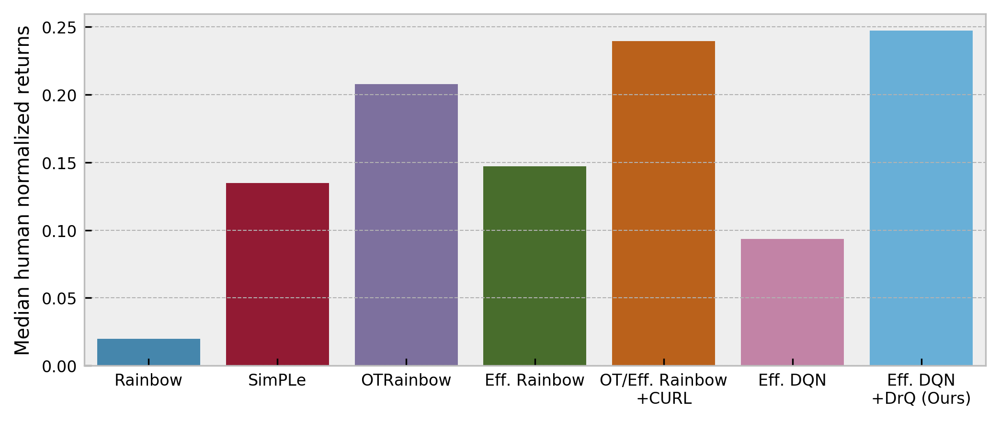

# DrQ: Data regularized Q

This is a PyTorch implementation of **DrQ** from

**Image Augmentation Is All You Need: Regularizing Deep Reinforcement Learning from Pixels** by

[Denis Yarats*](https://cs.nyu.edu/~dy1042/), [Ilya Kostrikov*](https://github.com/ikostrikov), [Rob Fergus](https://cs.nyu.edu/~fergus/pmwiki/pmwiki.php).

*Equal contribution. Author ordering determined by coin flip.

[[Paper]](https://arxiv.org/abs/2004.13649) [[Webpage]](https://sites.google.com/view/data-regularized-q)

## Citation
If you use this repo in your research, please consider citing the paper as follows
```
@article{kostrikov2020image,
    title={Image Augmentation Is All You Need: Regularizing Deep Reinforcement Learning from Pixels},
    author={Ilya Kostrikov and Denis Yarats and Rob Fergus},
    year={2020},
    eprint={2004.13649},
    archivePrefix={arXiv},
    primaryClass={cs.LG}
}
```

## Requirements
We assume you have access to a gpu that can run CUDA 9.2. Then, the simplest way to install all required dependencies is to create an anaconda environment by running
```
conda env create -f conda_env.yml
```
After the instalation ends you can activate your environment with
```
source activate drq
```

## Instructions
To train the DrQ agent on the `Breakout` task run
```
python train.py env=Breakout
```
This will produce the `exp_local` folder, where all the outputs are going to be stored including train/eval logs, tensorboard blobs, and evaluation episode videos. To launch tensorboard run
```
tensorboard --logdir exp_local
```

The console output is also available in a form:
```
| train | E: 8 | S: 1686 | R: 3.0000 | FPS: 95.3196 | BR: 0.0822 | CLOSS: 1.1962

```
a training entry decodes as
```
train - training episode
E - total number of episodes 
S - total number of environment steps
R - episode return
FPS - frames per second
BR - average reward of a sampled batch
CLOSS - average loss of the critic
TLOSS - average loss of the temperature parameter
```
while an evaluation entry
```
| eval  | E: 20 | S: 20000 | R: 10.9356
```
contains 
```
E - evaluation was performed after E episodes
S - evaluation was performed after S environment steps
R - average episode return computed over `num_eval_episodes` (usually 10)
```

## The Atari 100k Benchmark
**DrQ** demonstrates the state-of-the-art performance on the Atari 100k benchmark (Kaiser et al., 2019)


